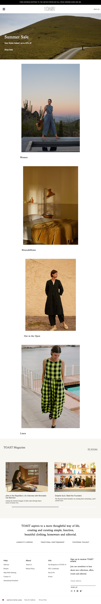

# Project: TOAST Website Clone

## **About Project**

Personal project for practicing more complex, high-end webpage building -

Create a functional clone of https://us.toa.st/ from scratch

# 'TOAST' website clone
*working project*

[Live Demo](https://lpasqualone.github.io/toast-site-clone/) 👈

### **Technologies and Tools Used**

* HTML
* CSS
* JavaScript

### Tools
* Visual Studio Code
* Chrome Developer Tools

### **Emphasized Concepts**

1. Write clean code that is well categorized
2. Breaking down a large project into manageable steps

*Process involved:*
  - Started from the top-down, creating the navbar, feature section, and shopping & magazine modules.
  - Scale website cleanly on all devices from **1440px and larger to 320px**, viewable for standard laptops to any size mobile device.
  - Create a **mega menu** with links to all other sections of the website.

## **Summary**

**Challenges I Faced**
* Creating the mega menu was a new learning, and a challenge to align properly with the navbar so as not to break other parts of the navigation 
* The magazine section was interesting to format - I didn't like how it looked with a  flex-wrap method, so created a slider for the tablet and mobile sizes instead.
* Creating the mobile dropdown is not usually a challenge, but I found that when I created the mega menu, it broke the usual system for how I would create a mobile menu. This required seeking out alternative plans to fix this issue.

**What I know**
* Creating dropdown navigation bar
* Effecient, practical use of columns systems
* Use of developer tools for solving problems
* Practical use of JS for interactivity
* UI/UX of ecommerce websites

**Where I can grow**
* Continue to practice creating menus, and writing code for toggles

 

## **Screenshots**

 

**Desktop** 

**Mega Menu** 

**Tablet**

